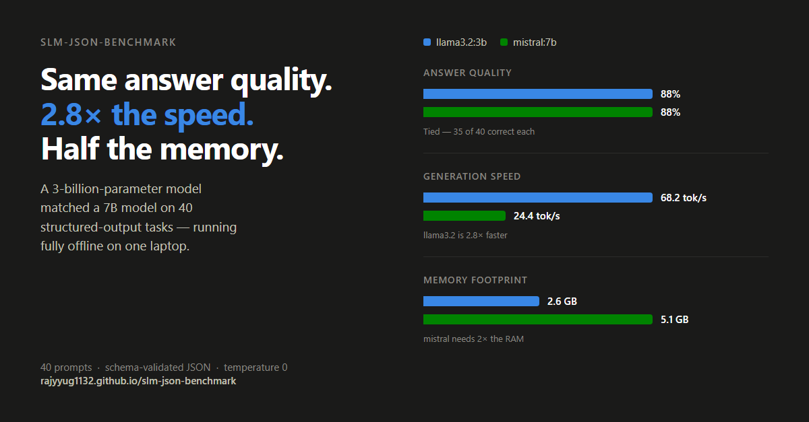

# slm-json-benchmark

[](https://rajyyug1132.github.io/slm-json-benchmark/leaderboard.html)
[](LICENSE)




Benchmarks how reliably small language models (3–7B) running **fully offline via [Ollama](https://ollama.com)** produce **schema-valid JSON** — plus the speed and memory cost of getting it.

**Live leaderboard:** [leaderboard.html](https://rajyyug1132.github.io/slm-json-benchmark/leaderboard.html)

## Why JSON-schema reliability matters for local SLMs

If you build anything on top of a local model — a CLI tool, an API, an agent — you don't consume prose, you consume **structured output**. A model that answers correctly but emits broken JSON (markdown fences, trailing commentary, missing keys, out-of-range values) is a model you can't program against. Cloud APIs paper over this with server-side constrained decoding; with a local SLM, *you* own that reliability. This benchmark measures it directly:

- **Schema validity (first try)** — the headline metric: fraction of responses that parse as JSON *and* pass strict [Pydantic validation](slm_app/schema.py) with no help.
- **Retry success** — when the first attempt fails, we feed the validation error back and reprompt (max 2 retries). This measures whether a model can self-correct.
- **Quality** — of the schema-valid answers, how many are actually right. Each prompt carries an `expect_any` list; a match requires the expected string at a **word boundary** (a plain substring test would let "au" match inside "because"). The boundary is required before the expectation but not after, so prefix expectations like "tech" still match "technology".
- **Speed** — time-to-first-token, total latency, tokens/sec (from Ollama's own `eval_count`/`eval_duration` counters).
- **Memory** — model footprint from Ollama's `/api/ps`.

## Leaderboard

| # | Model | Temp | Schema valid (1st try) | Final success | Retry success | Quality | Avg tok/s | Avg TTFT | Avg latency | Memory |
|---|-------|------|------------------------|---------------|---------------|---------|-----------|----------|-------------|--------|
| 1 | `mistral:7b` | 0.0 | 100% | 100% | – | 88% | 24.4 | 2.287s | 3.604s | 5061 MB |
| 2 | `llama3.2:3b` | 0.0 | 98% | 100% | 100% | 88% | 68.2 | 2.804s | 3.284s | 2555 MB |
| 3 | `phi3.5:3.8b` | 0.0 | 0% | 0% | – | – | – | – | – | 3800 MB |

> `phi3.5:3.8b` is a **failure row**, not a low score: its warm-up generation stalled indefinitely with the model loaded on GPU and was killed by a watchdog — twice, including a retry with a 15-minute budget. Per benchmark policy, model failures are recorded as data, not debugged.
>
> Notable trade-off: `llama3.2:3b` is ~2.8× faster and half the memory of `mistral:7b` for the same 88% answer quality — mistral's edge is a perfect 40/40 first-try schema record vs llama's 39/40 (recovered on retry #1).

*All rows measured on the same machine (Windows 11, Ollama). Ranked by first-try schema validity, ties broken by latency. Regenerate with `python make_leaderboard.py --markdown`.*

**Throughput varies between runs.** Two full runs of the same suite on the same machine put llama3.2's advantage at 2.5× and 2.8× (66.4 vs 27.1, then 68.2 vs 24.4 tok/s). Schema validity, quality, and memory were stable across both. Treat the tok/s column as approximate unless you average several runs.

### Where the answers actually fail

The aggregate 88%-vs-88% tie hides that the two models are good at *different things*:

| Model | classification | extraction | factual-qa | math | reasoning |
|-------|----------------|------------|------------|------|-----------|
| `llama3.2:3b` | 75% | 100% | 100% | **88%** | 67% |
| `mistral:7b` | 88% | 100% | 100% | **62%** | 83% |

Two things stand out. First, `mistral:7b` — more than twice the size — is markedly *worse* at math (62% vs 88%), while `llama3.2:3b` is weaker at reasoning (67% vs 83%). Picking on the headline number alone would hide that entirely; if your workload is arithmetic-heavy, the smaller model is the better choice on both quality and speed.

Second, **schema validity is nearly flat across categories at 100%** — the single first-try schema failure in the whole suite (llama3.2, math, 88% valid) was the lone exception. Structural compliance and answer correctness are independent axes: a model can be reliably parseable and reliably wrong.

Per-category numbers are written to `results/by_category.csv` by `compare.py`.

## Methodology

- **Prompt set:** [`benchmarks/prompts.jsonl`](benchmarks/prompts.jsonl) — 40 prompts across 5 categories: factual QA (10), math (8), classification (8), extraction (8), reasoning (6). Each has an `expect_any` list of accepted answer substrings.
- **Schema:** every response must be a bare JSON object `{"answer": str, "confidence": 0..1, "tags": [str] (≤5)}`, validated by [`slm_app/schema.py`](slm_app/schema.py). Markdown fences are stripped before parsing (models add them constantly); everything else must validate strictly.
- **No constrained decoding:** we deliberately do *not* use Ollama's `format: json` — the point is to measure the model's own instruction-following, with validation + retry as the recovery mechanism.
- **Retry policy:** on invalid output, the raw failed reply and the validation error are appended to the conversation and the model is asked to correct itself. Max 2 retries (3 attempts total).
- **Warm-up:** one throwaway generation before each suite so cold model loading doesn't pollute prompt 1's TTFT.
- **Temperature:** suite runs at temperature 0. A separate experiment ([`benchmarks/temperature_experiment.py`](benchmarks/temperature_experiment.py)) runs a 10-prompt subset 3× at temp 0.0 vs 0.7 measuring validity and output determinism.

### Temperature findings (llama3.2:3b, 10 prompts × 3 runs each)

| Temperature | Schema validity | Byte-identical answers across 3 runs |
|-------------|-----------------|--------------------------------------|
| 0.0 | 100% (30/30) | 10/10 prompts |
| 0.7 | 80% (24/30) | 4/10 prompts |

Temperature 0 gave fully deterministic, fully valid output. At 0.7 the same model lost 20% of its schema validity and only 4/10 prompts kept stable answers — for structured-output workloads on SLMs, sampling temperature is a reliability knob, not just a creativity knob.

## Reproduce (Windows)

```powershell
# 1. install Ollama (https://ollama.com/download) and pull the models
ollama pull llama3.2:3b
ollama pull phi3.5:3.8b
ollama pull mistral:7b

# 2. install deps
python -m pip install -r requirements.txt

# 3. run the suite per model (writes results/<model>.json)
python benchmarks/benchmark.py --model llama3.2:3b
python benchmarks/benchmark.py --model phi3.5:3.8b
python benchmarks/benchmark.py --model mistral:7b

# 4. aggregate + regenerate the leaderboard
python benchmarks/compare.py          # results/summary.csv + console table
python make_leaderboard.py            # leaderboard.html
python make_leaderboard.py --markdown # table for this README

# optional: temperature experiment
python benchmarks/temperature_experiment.py --model llama3.2:3b
```

Numbers are hardware-dependent — compare rows within one machine's results, not across machines.

## Use it as an app

```powershell
# CLI
python -m slm_app.cli "What is the capital of Japan?" --model llama3.2:3b

# API
python -m uvicorn slm_app.api:app --port 8000
# POST /ask {"question": "...", "model": "llama3.2:3b"}
```

Both return schema-validated JSON or fail loudly after retries — never unvalidated text.

## Layout

```
slm_app/          Ollama client (streaming metrics, retries), Pydantic schema, CLI, FastAPI
benchmarks/       prompts.jsonl, benchmark.py, compare.py, temperature_experiment.py
results/          raw per-model JSON + summary.csv (committed: the leaderboard's data)
make_leaderboard.py  regenerates leaderboard.html + the README table from results/
```
